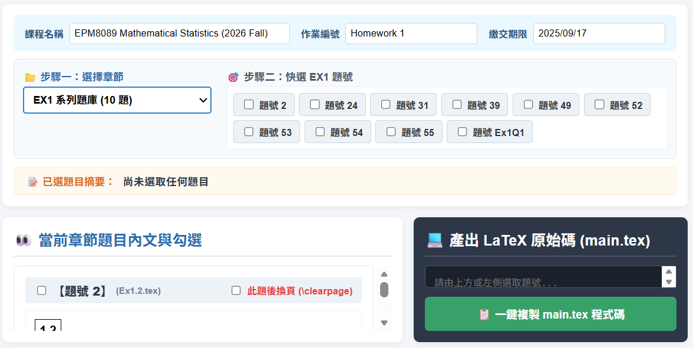
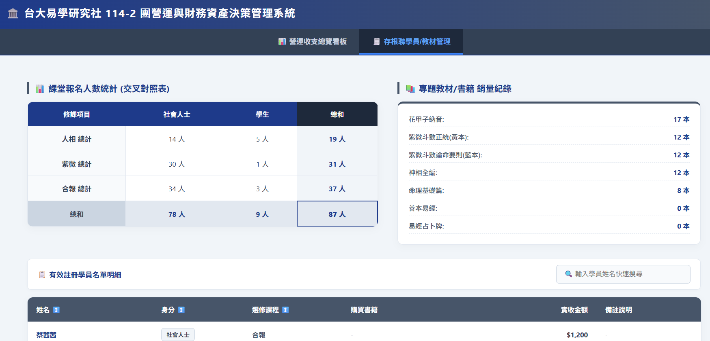
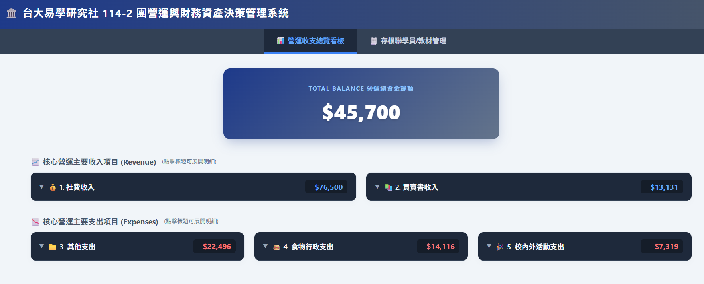
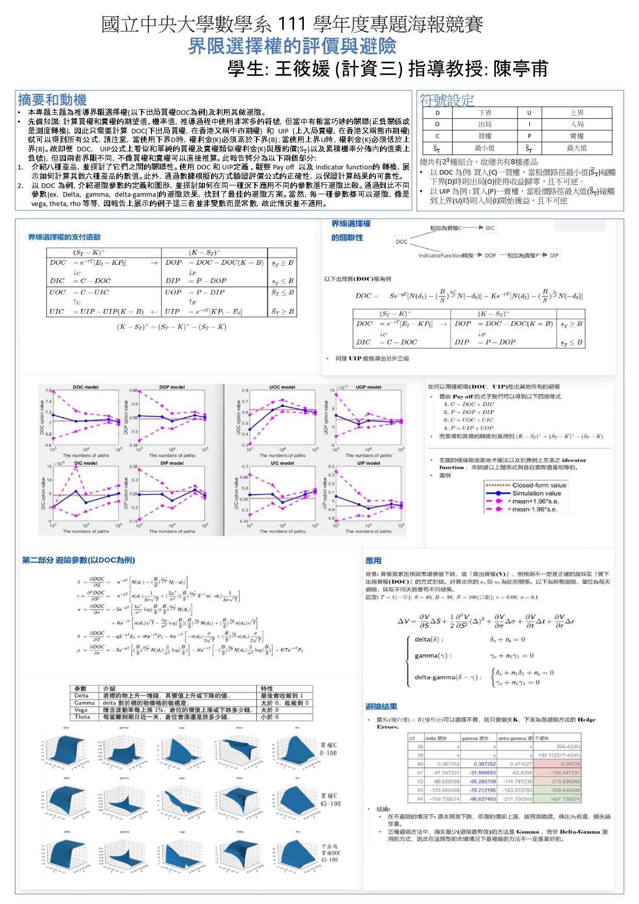

# 嗨，我是 筱媛！👋
**應徵職缺：資料科學家 / AI 演算法工程師 / 半導體智慧製造工程師**

---

## 🚀 精選 Side Projects (實作與自動化能力)

### 1. 數理統計作業自動化生成系統 (臺大數理統計課程助教專案)
* **時間軸**：📅 114.09 - 114.12
* **核心技術**：Latex, Google Apps Script (GAS), Regex, MathJax, HTML/CSS
* **項目實作細節**：
  * **背景與行政挑戰**：擔任助教期間負責課務與出題。過往出題流程繁瑣，需手動處理題庫 PDF 的換頁排版、重複修改作業序號與期限，且高度受限於裝置（必須手邊有電腦才能進行高頻率的複製貼上），屬於高度重複性的行政痛點。
  * **自動化執行方案**：將所有 `.tex` 題庫檔案移至雲端，利用 **GAS 獨立開發網頁版出題系統**。
  * **關鍵量化成果**：打破設備與空間限制（**現在出題僅需使用手機即可線上完成**）；將原先複雜的複製貼上情境縮減為直觀點選，**出題在 5 分鐘內即可搞定，出題效率顯著提升 60%**。

🔗 [點此進入：線上即時體驗網頁](https://script.google.com/macros/s/AKfycbxIqI8Mx2iI_m22nGlSWJW0gZNJp0sf3FmFH-gwinz4VEpYL_bu1_gLKf50stD6HbGQ8Q/exec)

---

### 2. 社團財務預算與講義庫存自動化管理系統 (臺大易學研究社總務專案)
* **時間軸**：📅 114.07 - 115.06
* **核心技術**：Excel / Google Sheets, Google Apps Script (GAS) 自動化, 資料結構設計, 庫存管理
* **項目實作細節**：
  * **背景與營運挑戰**：每學期需管控 90–100 位龐大學友的帳目、社費與講義庫存。過往傳統紙本簽名與現金交易紀錄分散、極易出錯，且常因手寫筆跡無法辨識導致對帳困難，每次人工統整學友名單皆需**耗費整整 2 小時**。
  * **自動化執行方案**：於就任第二學期全面推動**社團數位轉型**，首度建立 Excel 表單電子化流程。建構整合式財務與庫存資料模型，編寫 **GAS 自動化管理腳本**，將「存根聯紀錄」與「帳目明細」進行跨資料表動態即時關聯。
  * **關鍵量化成果**：全面消除人為辨識誤差與人工核對時間，需要名單時，由原先的 2 小時手工整理**優化至即時（0秒）自動產出**。成功將團隊「雙手與想像力」從繁瑣行政中解放，大幅降低前後任交接困難度與人事溝通成本。

💻 [點此進入：社團財務預算與講義庫存自動化管理系統](https://script.google.com/macros/s/AKfycbTq8YdgK8zcEG7McIN6Qf3QQCslgfpfzFGvQEXpyP8f96jPKavwBJKg6gMVAU3vMXS/exec)

---

## 📊 學術研究專題 (統計建模與高維度數據分析)

### 1. A Generalized Information Model Selection Criterion for Product-Principal Component Analysis
* **時間與獎項**：📅 115.05 (2026.05) | 🏆 **傑出海報獎**（國立臺灣大學公共衛生學院生物統計學群 - 研究生成果海報展）
* **核心技術**：R 語言、廣義資訊準則 (GIC)、Product-PCA、高維度資料模擬、模型評估
* **研究實際說明**：
  * 結合廣義資訊準則（GIC）開發 **Product-PCA 降維模型**，透過高維度資料模擬與模型評估驗證。
  * 相較傳統 PCA-GIC 方法，在**維持相同數據還原能力**的前提下，成功**減少 15% ~ 20% 的主成分數量**，有效提升高維資料分析效率與模型解釋性。

---

### 2. 界限選擇權的評價與避險
* **時間與獎項**：📅 112.04 (2023.04) | 🏆 **佳作**（國立中央大學數學系 - 112 學年度專題海報競賽）
* **核心技術**：隨機過程、數值線性代數、衍生性金融商品評價、動態避險策略 (Delta/Gamma Hedging)
* **研究實際說明**：
  * 運用隨機過程、數值方法及數值線性代數理論，建構衍生性金融商品評價模型與動態避險策略。
  * 透過模擬分析不同市場情境下之風險暴露，驗證 **Delta Hedging 可降低約 62% 損失**，**Gamma Hedging 則可降低約 70% 損失**，顯著提升投資組合風險管理成效。

---

### 3. Direct Fast Solver for Incompressible Navier-Stokes Equations
* **時間與獎項**：📅 111.12 (2022.12) | 🎓 國立中央大學數學系學術專題研究
* **核心技術**：MATLAB、非線性流體系統模擬、二階精度 Projection Method、數值求解器開發
* **研究實際說明**：
  * 使用 **MATLAB** 自主開發二階精度 Projection Method 數值求解器，並成功應用於非線性流體系統模擬。
  * **在不增加額外 CPU 計算成本的條件下**，成功將數值誤差收斂階數**精準提升至 1.99**，完美兼顧運算效率與高品質的模擬精度。

